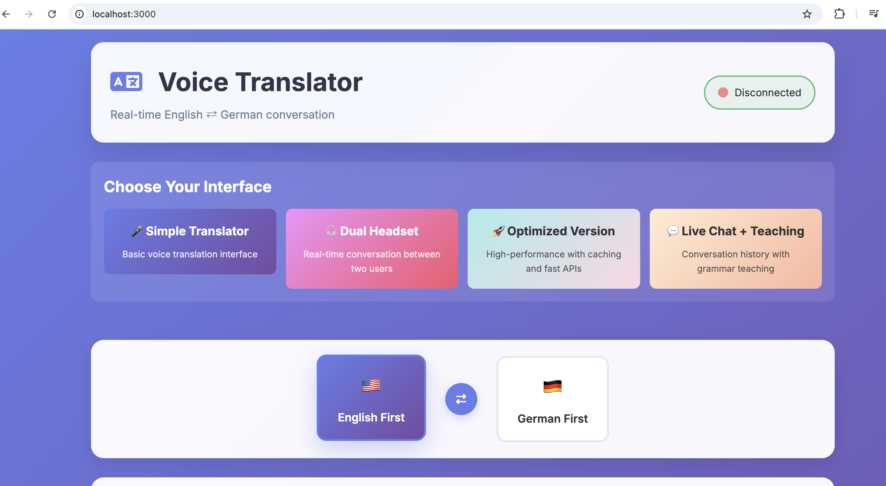
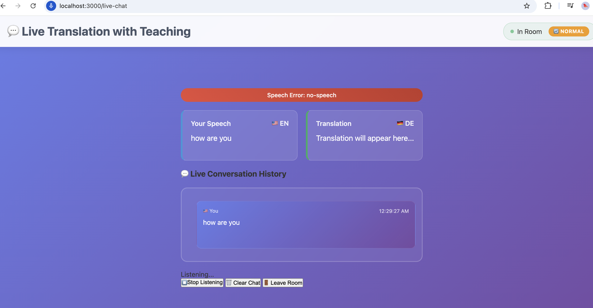
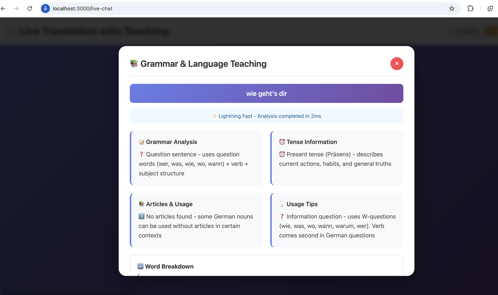
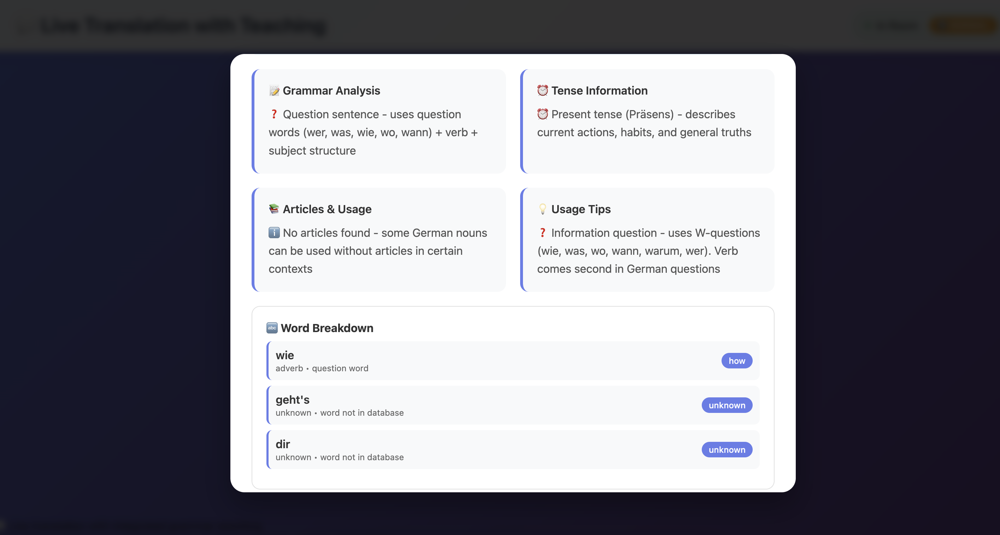
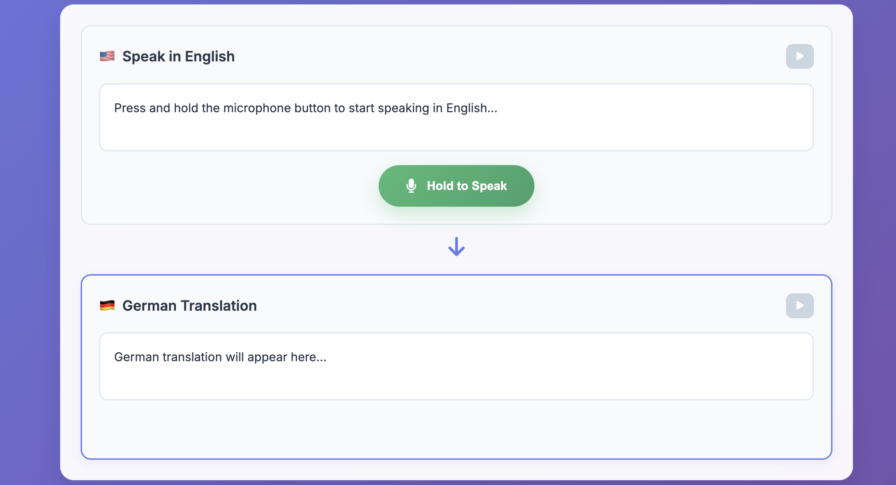

# Voice Translator App
## Real-time English ⇄ German Voice Translation with Self-Learning PostgreSQL Translation Memory

A modern, real-time voice translation application that enables seamless communication between English and German speakers using cutting-edge speech recognition, translation, and text-to-speech technologies. Now featuring a self-learning PostgreSQL translation memory system that improves over time.



*The Voice Translator application features a sleek interface with real-time translation capabilities, showing conversation history, audio visualization, and a self-learning translation memory system.*

## 🚀 Features

### Core Functionality
- **Real-time Voice Translation**: Press and hold to speak, get instant translation
- **Bidirectional Support**: English ⇄ German translation
- **Speech-to-Text**: Advanced speech recognition using OpenAI Whisper
- **Text-to-Speech**: High-quality voice synthesis
- **Live Conversation**: Real-time communication between users

### Modern UI/UX
- **Responsive Design**: Works on desktop, tablet, and mobile
- **Modern Interface**: Beautiful gradient design with smooth animations
- **Audio Visualizer**: Visual feedback during audio playback
- **Conversation History**: Track all translations in a session
- **Room Sharing**: Share conversation rooms for real-time collaboration

### Self-Learning Translation System
- **PostgreSQL 17 Translation Memory**: Context-aware translation storage and retrieval
- **Unknown Word Detection**: Identifies and tracks words that need translation
- **User Contribution System**: Interface for adding translations for unknown words
- **Automatic Learning**: Learns from sentence pairs in conversations
- **Confidence Scoring**: Assigns and updates confidence scores for translations
- **Domain Tagging**: Categorizes translations by domain for context-specific retrieval

### Technology Stack
- **Frontend**: Vanilla JavaScript, CSS3, HTML5
- **Backend**: Node.js, Express.js
- **Real-time**: Socket.IO for live communication
- **Speech Processing**: OpenAI Whisper (STT) and TTS
- **Translation**: OpenAI GPT for contextual translation with PostgreSQL memory
- **Database**: PostgreSQL 17 for translation memory and learning
- **Audio Processing**: Web Audio API, MediaRecorder

## 📋 Prerequisites

- Node.js (v16 or higher)
- PostgreSQL 17 (or compatible version)
- OpenAI API key (for advanced features)
- Modern web browser with microphone access
- PostgreSQL 17 (for self-learning translation memory)

## 🛠️ Installation

1. **Clone or navigate to the project directory**:
   ```bash
   cd /Users/kunnath/Projects/mcpownserver
   ```

2. **Install dependencies**:
   ```bash
   npm install
   ```

3. **Set up PostgreSQL**:
   ```bash
   # For macOS users
   brew install postgresql@17
   brew services start postgresql@17
   
   # Run PostgreSQL setup script
   ./setup_postgres_macos.sh
   
   # For other platforms, run
   ./setup_postgres.sh
   ```

4. **Set up environment variables**:
   ```bash
   # Create .env file with your settings, or use the example below
   cat > .env << EOL
   # OpenAI API Configuration (Optional)
   OPENAI_API_KEY=your_openai_api_key_here

   # Server Configuration
   PORT=3000
   NODE_ENV=development

   # PostgreSQL Configuration
   PG_HOST=localhost
   PG_PORT=5432
   PG_DATABASE=translation_memory
   PG_USER=postgres
   PG_PASSWORD=your_postgres_password
   EOL
   ```

5. **Start the development server**:
   ```bash
   npm run dev
   ```

6. **Open your browser** and navigate to:
   ```
   http://localhost:3000
   ```

## 🎯 Usage

### Basic Translation
1. **Select Language Direction**: Choose English→German or German→English
2. **Grant Microphone Permission**: Allow browser access to your microphone
3. **Hold to Speak**: Press and hold the microphone button while speaking
4. **Get Translation**: Release the button to get instant translation with audio

### Advanced Features
- **Swap Languages**: Click the exchange icon to quickly switch translation direction
- **Play Audio**: Use play buttons to replay original or translated audio
- **View History**: Scroll through conversation history
- **Share Room**: Copy room code to share with others for real-time conversation

### Keyboard Shortcuts
- **Spacebar**: Hold to record (same as mouse/touch)

## 🚀 Available Interfaces

### 1. 🎤 Simple Translator (`http://localhost:3000/`)
- Basic voice translation interface
- Single-user translation testing
- Simple and straightforward

### 2. 🎧 Dual Headset (`http://localhost:3000/dual-headset`)
- Real-time conversation between two users
- Room-based communication
- Original headset-optimized interface

### 3. 🚀 Optimized Version (`http://localhost:3000/optimized`)
- High-performance translation with caching
- Multi-tier translation architecture
- 60-99% performance improvement
- Real-time performance metrics

### 4. 💬 Live Chat + Teaching (`http://localhost:3000/live-chat`) **NEW!**
- **Conversation history in chat format**
- **"Teach Me" button on each message**
- **Grammar, tense, and article analysis**
- **Word-by-word breakdown with meanings**
- **Interactive language learning**
- **Unknown word detection and contribution panel**
- **Self-learning translation memory**

## 📚 Teaching Feature Details

### What You Learn
When you click "📚 Teach Me" on any message, you get:



#### 📝 Grammar Analysis
- Sentence structure breakdown
- Subject, verb, object identification
- Grammar rules explanation
- Common patterns and exceptions

#### ⏰ Tense Information
- Present, past, future tense identification
- Perfect and progressive forms
- When and how to use each tense
- Conjugation patterns

#### 📚 Articles & Usage (German)
- Der, die, das rules and exceptions
- Nominative, accusative, dative, genitive cases
- When to use definite vs indefinite articles
- Common article patterns

#### 💡 Usage Tips
- Formal vs informal language
- Common phrases and idioms
- Cultural context
- Alternative ways to express the same idea

#### 🔤 Word Breakdown
- Individual word meanings
- Word types (noun, verb, adjective, etc.)
- Etymology and related words
- Usage examples


### Example Teaching Session
```
User says: "Ich möchte einen Kaffee, bitte."
Translation: "I would like a coffee, please."

Teaching Analysis:
📝 Grammar: Polite request using "möchte" (would like)
⏰ Tense: Conditional/polite form of "mögen"
📚 Articles: "einen" = accusative masculine article for "Kaffee"
💡 Usage: Polite way to order in German
🔤 Words: ich (I), möchte (would like), einen (a/an), Kaffee (coffee), bitte (please)
```

## 🎯 Quick Start Guide

## 🆕 New Feature: Live Chat with In-Message Teaching



*The Live Chat with Teaching feature provides an interactive learning experience, allowing users to understand grammar, tenses, and article usage through an intuitive interface.*

### What's New?
- **Live Conversation History**: See all translated messages in a chat-like interface
- **In-Chat Teaching Buttons**: Click "📚 Teach Me" on any message to get detailed grammar analysis
- **Message-Specific Learning**: Each teaching session focuses on the specific sentence you clicked
- **Real-time Learning**: Learn grammar, tenses, articles, and word usage instantly
- **Self-Learning Translation Memory**: PostgreSQL-backed system that improves over time
- **Unknown Word Detection**: System identifies words it doesn't know and tracks them
- **User Contribution Panel**: Help improve the system by adding translations for unknown words

### How It Works
1. **Join a conversation** using the Live Chat interface
2. **Speak and translate** messages appear in chat format
3. **Click "Teach Me"** on any message bubble to learn about that specific sentence
4. **Get detailed analysis** including:
   - Grammar structure and rules
   - Tense identification and usage
   - Articles (der, die, das) and their rules
   - Word-by-word breakdown with meanings
   - Usage tips and examples
5. **Check unknown words panel** to see words the system is learning
6. **Contribute translations** for unknown words to improve the system
7. **System learns automatically** from your conversations and grows more accurate over time

### Available Interfaces
- The Live Chat with Teaching feature is available in the **Teaching-Enhanced Interface** and the **Optimized Interface**.

## 🏗️ Architecture

### Frontend Components
```
public/
├── index.html          # Main HTML structure
├── styles.css          # Modern CSS with animations
├── app.js              # JavaScript application logic
├── dual-headset.html   # Dual headset interface
├── dual-headset.js     # Dual headset logic
├── live-chat-with-teaching.html  # Live chat interface with teaching features
└── optimized-translation-client.js  # Optimized client implementation
```

### Backend Services
```
src/
├── services/
│   ├── VoiceTranslator.js         # Speech-to-text and text-to-speech
│   ├── TranslationService.js      # Text translation logic
│   ├── FastTranslationService.js  # Performance-optimized translation
│   ├── GrammarTeachingService.js  # Grammar analysis and teaching
│   ├── OllamaService.js           # Local LLM integration
│   └── TranslationMemoryDB.js     # PostgreSQL translation memory system
│
└── config/
    └── database.js                # PostgreSQL connection configuration
```

### Database Schema
```
PostgreSQL 17 Tables:
├── language_pairs        # Supported language pairs
├── translations          # Stored translations with confidence scores
├── unknown_words         # Words needing translation
├── user_contributions    # User-provided translations
└── learning_sessions     # User learning activity tracking
```

### Key Technologies

#### Speech Recognition
- **Primary**: OpenAI Whisper API for server-side processing
- **Fallback**: Web Speech API for browser-based recognition
- **Audio Format**: WebM with Opus codec for optimal quality

#### Translation Engine
- **Primary**: OpenAI GPT-3.5-turbo for contextual translation
- **Secondary**: PostgreSQL translation memory for known phrases
- **Fallback**: Basic dictionary lookup for offline operation
- **Context Awareness**: Maintains conversation context and tone

#### Text-to-Speech
- **Primary**: OpenAI TTS with high-quality voices
- **Fallback**: Web Speech Synthesis API
- **Voice Selection**: Automatic voice selection based on language

#### Database System
- **Engine**: PostgreSQL 17
- **Connection Pool**: Managed connection pooling for performance
- **Query Optimization**: Indexes on frequently queried fields
- **Transaction Support**: ACID-compliant transactions for data integrity

## 🔧 Configuration

### Environment Variables
```bash
# Required for advanced features
OPENAI_API_KEY=your_api_key_here

# Optional server configuration
PORT=3000
NODE_ENV=development

# PostgreSQL configuration
PG_HOST=localhost
PG_PORT=5432
PG_DATABASE=translation_memory
PG_USER=postgres
PG_PASSWORD=your_postgres_password
PG_POOL_MAX=20
PG_IDLE_TIMEOUT=30000
```

### PostgreSQL Translation Memory
The application uses PostgreSQL 17 for its translation memory system. Key features include:

- **Tables**:
  - `language_pairs`: Tracks supported language pairs
  - `translations`: Stores word/phrase translations with confidence scores
  - `unknown_words`: Records words that need translation
  - `user_contributions`: Tracks user-provided translations
  - `learning_sessions`: Monitors user learning activities

- **Administration**:
  ```bash
  # Connect to the database
  psql -d translation_memory
  
  # View translation statistics
  SELECT COUNT(*) FROM translations;
  
  # View unknown words needing translation
  SELECT word, occurrence_count FROM unknown_words ORDER BY occurrence_count DESC LIMIT 10;
  ```

### Audio Settings
The app automatically configures optimal audio settings:
- **Sample Rate**: 16kHz for optimal speech recognition
- **Channels**: Mono for efficiency
- **Echo Cancellation**: Enabled
- **Noise Suppression**: Enabled

## 🎨 Customization

### Adding New Languages
To add support for additional languages:

1. **Update language mappings** in `TranslationService.js`:
   ```javascript
   const langMap = {
     'en': 'English',
     'de': 'German',
     'fr': 'French'  // Add new language
   };
   ```

2. **Add UI elements** in `index.html` and `app.js`
3. **Update speech recognition** language codes

### Styling Customization
The CSS uses CSS custom properties for easy theming:
```css
:root {
  --primary-color: #667eea;
  --secondary-color: #764ba2;
  --success-color: #48bb78;
  --error-color: #f56565;
}
```

## 🚀 Performance Optimizations

### Audio Processing
- **Chunked Processing**: Real-time audio streaming
- **Compression**: Optimal audio codec selection
- **Buffering**: Smart buffering for smooth playback

### Network Optimization
- **WebSocket**: Low-latency real-time communication
- **Audio Compression**: Base64 encoding with optimal compression
- **Error Handling**: Robust error recovery and fallbacks

### Browser Compatibility
- **Progressive Enhancement**: Graceful degradation for older browsers
- **Feature Detection**: Automatic fallback to available APIs
- **Mobile Optimization**: Touch-friendly interface

## 📱 Mobile Support

The app is fully responsive and optimized for mobile devices:
- **Touch Gestures**: Hold-to-record functionality
- **Responsive Layout**: Adapts to all screen sizes
- **Mobile Optimization**: Optimized for mobile browsers
- **Offline Fallbacks**: Basic functionality without server connection

## 🔒 Privacy & Security

- **No Data Storage**: Audio is processed in real-time and not stored
- **Secure Transmission**: All communication over HTTPS (in production)
- **Microphone Access**: Only when explicitly granted by user
- **Room Isolation**: Conversations are isolated by room codes

## 🛠️ Development

### Available Scripts
```bash
npm start          # Start production server
npm run dev        # Start development server with auto-reload
npm run client     # Start static file server for frontend only
```

### API Endpoints
```
# Translation API
POST /api/translate-audio    # Upload audio for translation
POST /api/translate-text     # Translate text directly

# Translation Memory API
GET  /api/teach/unknown-words/:sourceLang/:targetLang  # Get unknown words
POST /api/teach/word-translation                       # Submit translation for unknown word
GET  /api/teach/translation-stats                      # Get translation memory statistics
```

### WebSocket Events
```javascript
// Client to Server
'join-room'               // Join a conversation room
'audio-stream'            // Send audio for real-time translation
'ask-grammar-question'    // Request grammar explanation
'get-unknown-words'       // Request list of unknown words

// Server to Client
'translated-audio'        // Receive translated audio
'translation-error'       // Handle translation errors
'grammar-explanation'     // Receive grammar teaching
'unknown-words-response'  // Receive list of unknown words
```

## 🚀 Deployment

### Production Build
1. Set production environment variables
2. Build optimized version:
   ```bash
   NODE_ENV=production npm start
   ```

### Docker Deployment
```dockerfile
FROM node:18-alpine
WORKDIR /app
COPY package*.json ./
RUN npm ci --only=production
COPY . .
EXPOSE 3000
CMD ["npm", "start"]
```

## 🤝 Contributing

1. Fork the repository
2. Create a feature branch
3. Make your changes
4. Test thoroughly
5. Submit a pull request

## 📄 License

MIT License - see LICENSE file for details

## 🆘 Troubleshooting

### Common Issues

**Microphone Not Working**:
- Ensure microphone permissions are granted
- Check browser compatibility
- Try refreshing the page

**Translation Errors**:
- Verify OpenAI API key is set correctly
- Check network connection
- Ensure audio input is clear

**Audio Playback Issues**:
- Check browser audio permissions
- Verify audio codec support
- Try different browsers

**PostgreSQL Connection Issues**:
- Verify PostgreSQL is running with: `brew services list` or `pg_isready`
- Check your connection details in `.env` file match your PostgreSQL installation
- Ensure the `translation_memory` database exists: `psql -l`
- Try running the setup script again: `./setup_postgres_macos.sh`
- Check PostgreSQL logs: `tail -f /opt/homebrew/var/log/postgresql@17.log`

**Database Setup Errors**:
- Error message `database "translation_memory" does not exist`: Run the setup script or create manually:
  ```sql
  createdb translation_memory
  ```
- Error with table creation: Check permissions and try manual initialization:
  ```sql
  psql -d translation_memory -f schema.sql
  ```

**Application Startup Failures**:
- Check error messages in the console
- Verify all dependencies are installed: `npm install`
- Ensure PostgreSQL connection is working: `psql -d translation_memory -c "SELECT NOW();"`
- Restart PostgreSQL if needed: `brew services restart postgresql@17`

### PostgreSQL Debugging

**Checking PostgreSQL Status**:
```bash
# Check if PostgreSQL is running
brew services list | grep postgres

# Check if database exists
psql -l

# Connect to the database
psql -d translation_memory

# Within psql, useful commands:
\dt         # List all tables
\d+ table_name  # Describe a specific table
SELECT COUNT(*) FROM translations;  # Count records
```

**Viewing Database Contents**:
```bash
# Check for unknown words
psql -d translation_memory -c "SELECT word, occurrence_count FROM unknown_words ORDER BY occurrence_count DESC LIMIT 10;"

# View recent translations
psql -d translation_memory -c "SELECT source_word, target_word, confidence FROM translations ORDER BY created_at DESC LIMIT 10;"

# Check translation memory statistics
psql -d translation_memory -c "SELECT COUNT(*) FROM translations;"
```

**Resetting the Database**:
```bash
# Drop and recreate the database (warning: destroys all data)
dropdb translation_memory
createdb translation_memory

# Or run the setup script again
./setup_postgres_macos.sh
```

**Transaction Log Issues**:
If you encounter errors related to transaction logs or database corruption:
```bash
# For macOS with Homebrew:
brew services stop postgresql@17
rm -rf /opt/homebrew/var/postgresql@17/pg_wal/*
brew services start postgresql@17
```

### Browser Compatibility
- **Chrome/Chromium**: Full support
- **Firefox**: Full support
- **Safari**: Limited Web Speech API support
- **Mobile Browsers**: Optimized support

### Real-time Application Debugging

**Socket.IO Connection Issues**:
- Check browser console for connection errors
- Verify firewall settings aren't blocking WebSocket connections
- Try disabling browser extensions that might interfere with WebSockets

**Memory Usage and Performance**:
- Monitor server performance with: `top -pid $(pgrep -f "node server.js")`
- Check for memory leaks by observing memory usage over time
- For slow translation responses, verify PostgreSQL query performance:
  ```sql
  EXPLAIN ANALYZE SELECT * FROM translations WHERE language_pair_id = 1;
  ```

**Logging and Diagnostics**:
- Enable detailed logging by setting `DEBUG=true` in your `.env` file
- Check application logs for errors
- Monitor PostgreSQL logs: `tail -f /opt/homebrew/var/log/postgresql@17.log`
- Use browser developer tools to monitor network requests and WebSocket activity

## 📞 Support

For issues and questions:
1. Check the troubleshooting section
2. Review browser console for errors
3. Ensure all prerequisites are met
4. Check network connectivity

---

**Built with ❤️ for seamless cross-language communication**
# -DualHeadTranslator

## 📘 About This Project

This Voice Translator is a comprehensive solution designed to break down language barriers between English and German speakers. It combines state-of-the-art speech recognition, machine translation, and text-to-speech technologies to provide a seamless, real-time communication experience.

### Key Use Cases:
- **Business Meetings**: Facilitate international business conversations without an interpreter
- **Language Learning**: Practice pronunciation and grammar with real-time feedback
- **Travel Communication**: Communicate effectively while traveling in German-speaking regions
- **Educational Settings**: Support language education with grammar breakdowns and teaching features
- **Remote Communication**: Enable effective multilingual video calls and remote meetings

The application is built using a modern tech stack including Node.js, Express, Socket.IO for real-time communication, and advanced AI services for translation. It offers multiple interfaces tailored to different use cases, from simple translation to advanced teaching features.

## 🎯 System Requirements

- **Operating System**: Windows 10+, macOS 10.15+, or Linux
- **Browser**: Chrome/Edge (recommended), Firefox, Safari
- **Hardware**: 
  - 4GB RAM minimum (8GB recommended)
  - Microphone access
  - Speakers or headphones
- **Network**: Stable internet connection (1Mbps+)
- **Server Requirements** (if self-hosting):
  - Node.js v16+ 
  - 2GB RAM minimum
  - 500MB disk space

## 🔧 Troubleshooting Common Issues

### Connection Issues
If you experience connection problems:
```
1. Check your internet connection
2. Ensure server is running (for self-hosted setups)
3. Try clearing browser cache and cookies
4. Verify firewall is not blocking WebSocket connections
```

### Audio Quality Issues
For optimal audio quality:
```
1. Use a good quality microphone in a quiet environment
2. Speak clearly and at a moderate pace
3. Check microphone permissions in browser settings
4. Adjust input volume settings in your OS
```

### Translation Accuracy
To improve translation accuracy:
```
1. Speak in complete sentences
2. Avoid very technical jargon or slang when possible
3. For German, pronounce articles clearly
4. Use the teaching feature to understand translation nuances
```

## 📱 Mobile Access Instructions

This application is fully responsive and works on mobile devices:
1. Open the application URL in your mobile browser
2. Grant microphone permissions when prompted
3. Use in landscape mode for optimal experience 
4. For iOS users, ensure Safari has microphone permissions

## 🛡️ Privacy Information

- **Audio Processing**: Audio is processed in real-time and not stored permanently
- **Translation Data**: Text translations are cached temporarily to improve performance
- **Room Conversations**: Conversations are isolated by room and not accessible to other users
- **Data Security**: All communications use secure connections (HTTPS/WSS)
- **Third-party Services**: The application may utilize external translation APIs with their own privacy policies

## 🌐 Multi-Platform Support

The Voice Translator is designed to work across multiple platforms:

- **Web Browsers**: Chrome, Firefox, Edge, Safari
- **Desktop**: macOS, Windows, Linux
- **Mobile**: iOS and Android (via responsive web interface)
- **Alternative Access**: Streamlit interface for Python environments

## 🤝 Community & Support

- **Questions & Support**: Submit issues via GitHub or use the support contact form
- **Feature Requests**: We welcome suggestions for new features or language pairs
- **Contributions**: Pull requests are welcome - see Contributing section
- **Updates**: Regular updates with new features and performance improvements

This comprehensive documentation should help any user understand, install, and effectively use the Voice Translator application for their communication needs.

## 🧠 PostgreSQL Translation Memory System

The application features a sophisticated self-learning translation memory system built on PostgreSQL 17. This system learns from conversations, improves over time, and allows users to contribute directly to its knowledge base.

### Key Components

#### 1. Translation Storage & Retrieval
- **Context-Aware Storage**: Translations are stored with context examples
- **Confidence Scoring**: Each translation has a confidence score that adjusts over time
- **Usage Tracking**: System tracks how often each translation is used
- **User Verification**: Tracks whether translations have been verified by users

#### 2. Unknown Word Management
- **Automatic Detection**: System identifies words it can't translate confidently
- **Occurrence Tracking**: Tracks how often unknown words appear
- **Context Capture**: Stores the context in which unknown words appear
- **Priority Sorting**: Highlights most frequently occurring unknown words

#### 3. User Contribution Interface
- **Word List**: Shows unknown words that need translation
- **Simple Input**: Easy interface to add translations
- **Verification System**: User contributions are marked as verified
- **Instant Integration**: Contributed translations are immediately available

#### 4. Automatic Learning
- **Sentence Pair Analysis**: System analyzes full sentence pairs to learn word mappings
- **Confidence Adjustment**: Translation confidence increases with repeated successful use
- **Pattern Recognition**: Learns common patterns in translations
- **Domain-Specific Learning**: Can tag translations with domain context (e.g., business, travel)

### Usage Statistics
The system provides usage statistics through the API:
- Total number of stored translations
- Number of unknown words
- User contribution counts
- Learning rate (new words per day/week/month)

### Database Management

To monitor and manage the translation memory system:

```bash
# Check translation count
psql -d translation_memory -c "SELECT COUNT(*) FROM translations;"

# View top unknown words
psql -d translation_memory -c "SELECT word, occurrence_count FROM unknown_words ORDER BY occurrence_count DESC LIMIT 10;"

# Check recent user contributions
psql -d translation_memory -c "SELECT source_word, target_word, created_at FROM user_contributions ORDER BY created_at DESC LIMIT 10;"

# View language pairs
psql -d translation_memory -c "SELECT source_lang, target_lang FROM language_pairs;"
```

### System Architecture
The translation memory is implemented through several interconnected components:
- `TranslationMemoryDB.js`: Core database interaction layer
- `GrammarTeachingService.js`: Integrates teaching features with memory system
- `database.js`: Manages PostgreSQL connection and pool
- Frontend interface in `live-chat-with-teaching.html`

### Performance Considerations
The system is optimized for:
- Fast lookup of known translations
- Efficient storage and retrieval of context information
- Minimal latency impact on real-time translation
- Scalable design for growing translation databases

## 🗄️ Database Setup & Maintenance

### Manual PostgreSQL Setup

If you need to manually set up the PostgreSQL database:

```bash
# Create the database
createdb translation_memory

# Connect to the database
psql -d translation_memory

# Within psql, create the necessary tables:
CREATE TABLE language_pairs (
  id SERIAL PRIMARY KEY,
  source_lang VARCHAR(10) NOT NULL,
  target_lang VARCHAR(10) NOT NULL,
  UNIQUE(source_lang, target_lang)
);

CREATE TABLE translations (
  id SERIAL PRIMARY KEY,
  language_pair_id INTEGER REFERENCES language_pairs(id),
  source_word TEXT NOT NULL,
  target_word TEXT NOT NULL,
  confidence FLOAT NOT NULL DEFAULT 0.5,
  usage_count INTEGER NOT NULL DEFAULT 1,
  user_verified BOOLEAN NOT NULL DEFAULT FALSE,
  created_at TIMESTAMP WITH TIME ZONE DEFAULT CURRENT_TIMESTAMP,
  updated_at TIMESTAMP WITH TIME ZONE DEFAULT CURRENT_TIMESTAMP,
  context_examples JSONB DEFAULT '[]',
  domain_tags JSONB DEFAULT '[]',
  UNIQUE(language_pair_id, source_word)
);

CREATE TABLE unknown_words (
  id SERIAL PRIMARY KEY,
  language_pair_id INTEGER REFERENCES language_pairs(id),
  word TEXT NOT NULL,
  occurrence_count INTEGER NOT NULL DEFAULT 1,
  first_seen TIMESTAMP WITH TIME ZONE DEFAULT CURRENT_TIMESTAMP,
  last_seen TIMESTAMP WITH TIME ZONE DEFAULT CURRENT_TIMESTAMP,
  contexts JSONB DEFAULT '[]',
  UNIQUE(language_pair_id, word)
);

CREATE TABLE user_contributions (
  id SERIAL PRIMARY KEY,
  user_id TEXT NOT NULL,
  translation_id INTEGER REFERENCES translations(id),
  created_at TIMESTAMP WITH TIME ZONE DEFAULT CURRENT_TIMESTAMP,
  source_lang VARCHAR(10) NOT NULL,
  target_lang VARCHAR(10) NOT NULL,
  source_word TEXT NOT NULL,
  target_word TEXT NOT NULL
);

CREATE TABLE learning_sessions (
  id SERIAL PRIMARY KEY,
  user_id TEXT NOT NULL,
  session_start TIMESTAMP WITH TIME ZONE DEFAULT CURRENT_TIMESTAMP,
  session_end TIMESTAMP WITH TIME ZONE,
  source_lang VARCHAR(10) NOT NULL,
  target_lang VARCHAR(10) NOT NULL,
  words_learned INTEGER DEFAULT 0,
  words_practiced INTEGER DEFAULT 0
);

# Create necessary indexes
CREATE INDEX idx_translations_language_pair_id ON translations(language_pair_id);
CREATE INDEX idx_unknown_words_language_pair_id ON unknown_words(language_pair_id);
CREATE INDEX idx_unknown_words_occurrence ON unknown_words(occurrence_count DESC);
CREATE INDEX idx_user_contributions_user_id ON user_contributions(user_id);
CREATE INDEX idx_translations_confidence ON translations(confidence);
CREATE INDEX idx_translations_usage_count ON translations(usage_count);
CREATE INDEX idx_translations_created_at ON translations(created_at);
CREATE INDEX idx_unknown_words_last_seen ON unknown_words(last_seen);
```

### Database Backup & Restore

To backup your translation memory:

```bash
# Create a backup file
pg_dump -d translation_memory > translation_memory_backup.sql

# To restore from backup
createdb translation_memory  # If needed
psql -d translation_memory -f translation_memory_backup.sql
```

### PostgreSQL Maintenance

Regular maintenance tips:

```bash
# Vacuum the database to reclaim space and optimize performance
psql -d translation_memory -c "VACUUM ANALYZE;"

# Check database size
psql -d translation_memory -c "SELECT pg_size_pretty(pg_database_size('translation_memory'));"

# Find largest tables
psql -d translation_memory -c "SELECT relname, pg_size_pretty(pg_total_relation_size(relid)) FROM pg_catalog.pg_statio_user_tables ORDER BY pg_total_relation_size(relid) DESC;"
```

### Monitoring Translation Growth

Track how your translation memory is growing:

```bash
# Daily growth
psql -d translation_memory -c "SELECT COUNT(*) FROM translations WHERE created_at > NOW() - INTERVAL '1 day';"

# Weekly growth
psql -d translation_memory -c "SELECT COUNT(*) FROM translations WHERE created_at > NOW() - INTERVAL '7 days';"

# Most active language pairs
psql -d translation_memory -c "SELECT lp.source_lang, lp.target_lang, COUNT(t.id) FROM translations t JOIN language_pairs lp ON t.language_pair_id = lp.id GROUP BY lp.source_lang, lp.target_lang ORDER BY COUNT(t.id) DESC;"
```
